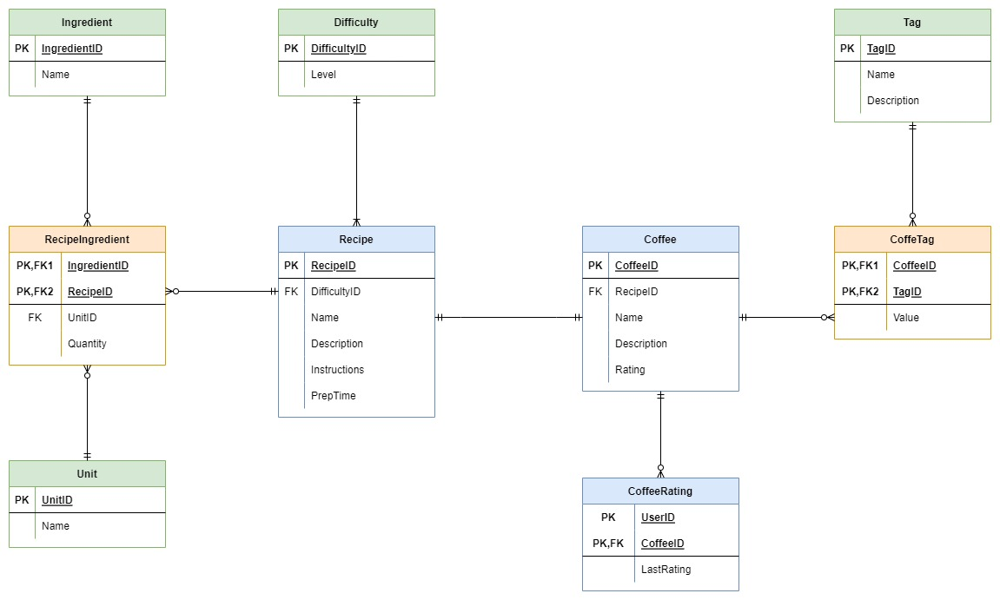

# coffee_connoisseur_API
<!-- PROJECT LOGO -->
<br />
<div align="center">
  

<h3 align="center">Coffee Connoisseur API</h3>

  <p align="center">
    
  </p>
</div>

<!-- ABOUT THE PROJECT -->
## About The Project
Essentially an app where ...
The reason for an app like this is to be able to say:

_“I want to make a coffee let me find a recipe to help make my next coffee.”_

```
App Features: 
* A new user can be registered
* A user can login
* A user can is confirmed
* All coffees can be viewed
* A single coffee can be looked up
* Get a coffee based on tags
* Get a coffee based on ingredients that you have available
* A recipe can be looked up and filtered based on difficulty
* A user can update their rating of a coffee
```

### Built With

* Java Spring
* MySQL
* AWS Cloud Formation
* AWS Cognito

<!-- ERD UPLOAD -->
### Entity Relational Diagram
 

 <!-- API ENDPOINTS-->
 ### API Endpoints
 ```
 * /coffee?sort-by={value} value=rating, difficulty
 * /coffees?tags={tag}&sort-by={value} value=rating, difficulty
 * /coffees?ingredients={ingredient}&sort-by={value}
 * /coffees?difficulty={difficulty}
 * /coffees/updateRating/{rating}
 * /coffees/{id}
 * /register
 * /login
 ```
 
<!-- MEET THE TEAM -->
## Development Team

- [ ] [Brad Betts]()
- [ ] [Marie van der Merwe]()
- [ ] [Nikita Smal](https://github.com/nikitasmal)
- [ ] [Phumzile Nkosi](https://github.com/PhumzileNkosi)
- [ ] [Razeen Bahadoor](https://github.com/SparklingCouscous)
- [ ] [Thabo Rachidi]()

<!-- REFERENCES -->
## References

* [AWS Documentation](https://docs.aws.amazon.com/)
* [MySQL Documentation](https://dev.mysql.com/doc/)
* [Java Spring Documentation](https://docs.spring.io/spring-framework/docs/current/reference/html/)
* [The Hive](https://the-hive.bbd.co.za/)
* [Pluralsight](https://app.pluralsight.com/)
